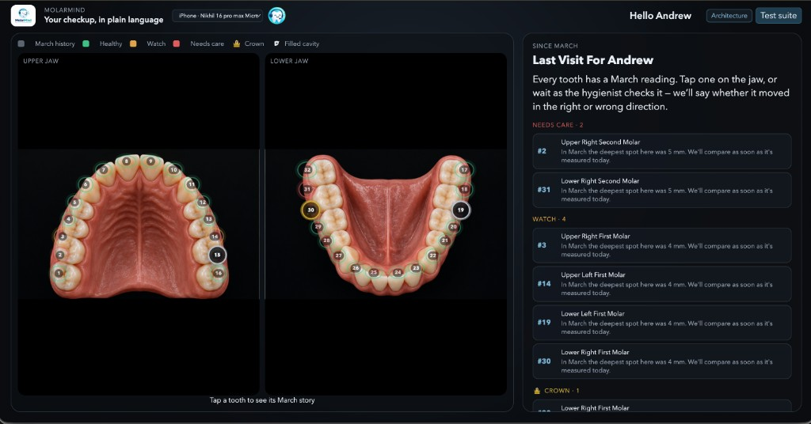

# MolarMind

MolarMind listens to a hygienist chart a periodontal exam, fills the tooth grid as they speak, and explains the same findings to the patient in everyday language.

It is a two-screen chairside demo. One window is for the clinician. The other is for the person in the chair. Speech is transcribed in the browser. Charting is a deterministic parser, not a guessing model. Nothing is written to a real practice-management system in this demo.

**Listens. Charts. Clarifies.**

**Read [About](#about) first.** If you open one screen in this demo, make it **`/about`**. That page is why MolarMind was built, and how it is meant to be used by the hygienist, the doctor, and the patient. Go there from the landing nav, or open `VITE_ABOUT_PATH` (default `/about`) once the app is running. Do not skip it.

## What you will see

The seeded patient is **Andrew**. His last visit was 12 March 2026. Today’s exam starts empty and fills only as speech (or the rehearsal script) lands.



| Screen | Default path | Who it is for |
| --- | --- | --- |
| **About** | `/about` | **Start here.** Why it was built; uses for hygienist, doctor, and patient |
| Clinician | `/clinician` | Hygienist: live grid, detailed report, Open Dental preview, hygienist script |
| Clinician Neo | `/clinician-neo` | Same live exam in a light product-style chart, with a tooth diagram and patient copy |
| Patient | `/patient` | Andrew: jaw map, March-vs-today captions, take-home card |
| Architecture | `/architecture` | One-page picture of the pipeline |
| Legal | `/privacy`, `/notice-of-privacy-practices`, `/terms`, `/cookies`, `/accessibility`, `/disclaimer`, `/hipaa`, `/privacy-choices` | Privacy, HIPAA notice, terms, cookies, accessibility, dental disclaimer, BAA posture, and state privacy choices |

Paths come from `.env`. Change `VITE_ABOUT_PATH`, `VITE_CLINICIAN_PATH`, `VITE_CLINICIAN_NEO_PATH`, `VITE_PATIENT_PATH`, `VITE_ARCHITECTURE_PATH`, and the `VITE_*` legal path variables if you need different routes. Do not hard-code loopback URLs in the app.

### About

Open **`/about`** before the clinician or patient windows. That is the About page: [src/views/AboutView.tsx](src/views/AboutView.tsx). It is the story of the product in one place: the gap in the operatory, then a card each for the hygienist, the doctor, and the person in the chair, with links into those live views. The words live in [`src/views/aboutCopy.ts`](src/views/aboutCopy.ts).

### Clinician

Use this when you want the working operatory tools: microphone picker, **Test event**, hygienist script, perio grid, detailed report, and the Open Dental write-back drawer.

- **Listen** starts on-device Whisper. Prefer the iPhone Continuity mic when it is available.
- **Heard** shows the latest transcript.
- **Show script** walks a cleaning-visit rehearsal. **Play** speaks the lines into the same parser the mic uses.
- **Neo** opens the light chart. **Architecture** opens the system diagram. **Test suite** runs the 51 utterance cases in the page.

### Clinician Neo

A light chairside layout for the same live exam: navy header, live transcription, status checklist, upper and lower grids, selected-tooth diagram, findings, and patient-friendly explanation.

- Today still starts empty. Numbers appear as you speak.
- Tooth **#14** is Andrew’s **upper left first molar**.
- Timeline, radiographs, notes, chart view, and the bottom chat box are visual stubs.
- The gear menu holds the mic picker, a test event, and a link back to classic clinician.
- **End visit** asks for a wrap-up. The patient screen then shows the take-home card.

### Patient

Andrew sees photographed arches, a number on every tooth, and plain-language copy.

- Crown and filling badges sit on the tooth. The number stays readable on top.
- When today’s pocket is deeper than March, the copy says it moved in the **wrong** direction. Shallower is the **right** direction.
- **End visit** / “let’s wrap up” builds the chairside take-home.

## Run the demo

You need Node.js 22+ and a Chromium-based browser with WebGPU for the fastest Whisper path.

```bash
npm install
```

Copy `.env.example` to `.env` and keep the demo keys as they are. Those Open Dental values are placeholders. They are never sent in this demo.

If you already run the Vite app yourself, open **`/about` first**, then the clinician and patient paths from your `.env` host and port. If you want the helper that starts Vite and opens both windows:

```bash
npm run demo
```

That opens the clinician route with `?script=demo1` and the patient route. Use **one Listen button at a time**. The iPhone Continuity microphone is exclusive — a leftover Listen on the other tab is the usual reason the room goes silent.

The first Whisper load can take a moment while the `onnx-community/whisper-base.en` q8 model caches. After that, the demo can run without a network on the critical path.

## How to talk to it

Universal numbering **1–32**. Say the tooth, then the numbers.

| You say | What it does |
| --- | --- |
| `Number fourteen` | Selects tooth 14 |
| `Three two three` | Writes the current side (buccal first). MB, B, DB |
| `Two two two` (next) | Writes the other side. ML, L, DL |
| Six numbers in one breath | Fills all six sites, MB → B → DB → ML → L → DL |
| `Distal five, bleeding` | One site plus bleeding on probing |
| `Watch` / `mobility one` / `recession two` | Flags and extra findings |
| `Make that five` / `scratch that` | Corrects the last reading |
| `Let's wrap up` | Builds the patient summary |

Tips that save a demo:

- Name the tooth before the pockets. Three numbers with no tooth do not write.
- “Facial” means buccal. “Palatal” or “lingual” means the tongue/palate side.
- Whisper often hears “to” for “two” and “for” for “four”. The lingo layer already maps those inside a triplet.
- Keep the phone unlocked and close. The first short burst under 700 ms is dropped on purpose so Continuity gating does not chart noise.

**Test event** on either clinician page charts “tooth fourteen, distal five, bleeding” without the mic.

## Andrew at a glance

March is the comparison visit. It is loaded from `src/data/andrew.json`.

- Most sites were 2–3 mm.
- Watch: **#3**, **#14** distal, **#19** at 4 mm.
- Needs care: **#2** and **#31** at 5 mm.
- Restorations: filling on **#15** and **#19**, crown on **#30**.

Today is empty until you chart. The patient jaw still shows March color as history until a tooth is measured today.

---

## Technical

MolarMind is a single-origin Vite + React + TypeScript app. There is no application server and no database process. Capture, parse, chart, translate, and the practice-management preview all run in the clinician tab. The patient tab is a second same-origin window. They share events over `BroadcastChannel` (`chairside-events`).

```
Hygienist speech
  → phone or Shokz mic
  → energy VAD
  → Whisper worker (WebGPU)
  → lingo rewrite
  → deterministic parser
  → Zustand exam store
      → clinician grid / Neo / detailed report
      → Open Dental mapper (built, not sent)
      → BroadcastChannel → patient jaw and captions
```

Speech never leaves the operatory on the critical path. Low-confidence transcripts appear under **Heard** and do not write the exam or the Open Dental mapper.

### Architecture

The in-app architecture page is the one-sheet you show in a room:

- Open the **Architecture** link from the clinician header, or go to `VITE_ARCHITECTURE_PATH` (default `/architecture`).
- The diagram is `public/architecture.svg`.

Legend on that sheet:

| Color / stroke | Meaning |
| --- | --- |
| Blue | Flow — speech through charting to both screens |
| Orange | Write-back — mocked Open Dental API calls |
| Dashed | Portal-style sync, not a live clinic write |

The longer decision record lives in [`architecture/`](architecture/README.md):

| File | Use |
| --- | --- |
| [`architecture/MolarMind-Architecture.pdf`](architecture/MolarMind-Architecture.pdf) | Read this. As-built architecture. |
| [`architecture/MolarMind-Architecture.html`](architecture/MolarMind-Architecture.html) | Browseable print source |
| [`architecture/04-architecture.md`](architecture/04-architecture.md) | Editable source, including Mermaid |
| [`architecture/diagrams/`](architecture/diagrams/) | System context and write-back sequence |

Regenerate the in-app SVG with `python3 scripts/build-architecture-svg.py` when the one-pager changes.

**Runtime choices that matter on stage**

- Vite serves the app with COOP/COEP headers so the Whisper worker and WebGPU can run.
- Mic preference: iPhone Continuity, then Shokz, then any headset.
- VAD: RMS 0.012, 550 ms silence, 700 ms minimum speech. A “no audio” warning only after 5 seconds of true quiet.
- Today’s exam is in-memory Zustand. Refresh clears today. March history stays in `andrew.json`.
- Open Dental REST shapes are built in `src/pms/opendental.ts` and shown in the write-back drawer. The demo does not POST to a clinic.

### Test suite

There are two ways to run the same charting contract.

**In the app.** On the classic clinician page, click **Test suite**. That runs all **51** parser cases through lingo + parser and shows pass/fail with the utterances and the chart events they produced. This is the suite you click during a demo if someone asks “does it really understand hygienist talk?”

**On the command line.**

```bash
npm test
```

Vitest runs every `src/**/*.test.ts` file in Node.

| File | What it protects |
| --- | --- |
| `src/domain/parser.test.ts` | All 51 utterance cases: navigation, triplets, six-site fills, BOP, recession, mobility, furcation, corrections, Whisper to/for, hygienist scripts, wrap-up |
| `src/domain/lingo.test.ts` | Spoken shorthand (`363`, `facial 222`, “three hundred sixty three”) without splitting “twenty six” |
| `src/domain/translator.test.ts` | Andrew’s March seed, watch/needs-care/restoration notes, and March-vs-today sentences |
| `src/pms/opendental.test.ts` | Mock API sequence: create perio exam, POST/PUT measures, bleeding/mobility/furcation, SkipTooth, existing crown D2740 EC, no writes on low confidence |

The parser cases are the source of truth for “what the hygienist can say.” They live in `src/domain/parser.cases.ts` and are shared by the in-app button and `npm test`. Adding a new way to speak means adding a case there, not teaching an LLM.

### Repository map

```
src/audio/          Mic, VAD, Whisper worker
src/bus/            BroadcastChannel
src/config/         Route env helpers
src/data/           Andrew seed JSON
src/domain/         Lingo, parser, exam, patient copy
src/legal/          Privacy, HIPAA, terms, cookies, and related copy
src/pms/            Open Dental request mapper
src/store/          Zustand visit state
src/views/          Landing, About, clinician, Neo, patient, architecture
architecture/       Full architecture pack
public/             Logos, jaw photos, architecture.svg
```

### Environment

| Variable | Role |
| --- | --- |
| `VITE_DEV_HOST` / `VITE_DEV_PORT` | Where Vite listens |
| `VITE_ABOUT_PATH` | About page (default `/about`) — read this first |
| `VITE_CLINICIAN_PATH` | Classic clinician |
| `VITE_CLINICIAN_NEO_PATH` | Light clinician |
| `VITE_PATIENT_PATH` | Patient screen |
| `VITE_ARCHITECTURE_PATH` | Architecture page |
| `VITE_PRIVACY_PATH` | Privacy Policy |
| `VITE_NPP_PATH` | HIPAA Notice of Privacy Practices |
| `VITE_TERMS_PATH` | Terms of Use |
| `VITE_COOKIES_PATH` | Cookie Policy |
| `VITE_ACCESSIBILITY_PATH` | Accessibility statement |
| `VITE_DISCLAIMER_PATH` | Dental disclaimer |
| `VITE_HIPAA_PATH` | HIPAA and Business Associate page |
| `VITE_PRIVACY_CHOICES_PATH` | CCPA / do-not-sell choices |
| `VITE_LEGAL_ENTITY` | Name on the legal pages |
| `VITE_LEGAL_EFFECTIVE_DATE` | Effective date (`YYYY-MM-DD`) |
| `VITE_LEGAL_JURISDICTION` | Governing-law label for Terms of Use |
| `VITE_PRIVACY_EMAIL` | Privacy-officer mailbox (leave empty until you have one) |
| `VITE_WHISPER_MODEL` / `VITE_WHISPER_DTYPE` | In-browser STT |
| `VITE_OPENDENTAL_*` | Demo mapper only — not sent |

Do not commit a real clinic developer/customer key pair.

### Privacy, HIPAA, and legal

The public site now ships the pages a dental product website is expected to have:

- Privacy Policy, HIPAA Notice of Privacy Practices, Terms of Use, Cookie Policy, Accessibility Statement, Dental Disclaimer, HIPAA & BAA, and Your Privacy Choices (CCPA / do-not-sell).
- A cookie banner that records Necessary only or Accept all in the browser. This build does not load advertising or analytics pixels.
- A short demo notice on clinician, Neo, patient, and architecture screens: sample chart data stays in the session, it is not a live record, and it is not a substitute for care.
- No Google Fonts request, so the marketing pages do not send visitor IPs to a third-party font CDN.

These pages are operational notices for this website and demo. They are not a complete HIPAA Security Rule program and they are not legal advice. A treating dental practice remains the covered entity for its patients. Do not enter real patient identifiers into the public demo. A clinic needs a signed Business Associate Agreement, access control, audit logs, HTTPS hosting, and counsel review before live protected health information is used.

Set `VITE_PRIVACY_EMAIL` when you have a privacy-officer mailbox so the legal pages can publish it. Set `VITE_LEGAL_ENTITY`, `VITE_LEGAL_EFFECTIVE_DATE`, and `VITE_LEGAL_JURISDICTION` to match the organization that operates the deployment.

### What this demo is not

No login, no durable visit store, no live Open Dental writes, no LLM between transcript and tooth cell. SSO and multi-chair hosting are still out of scope. The architecture pack lists the path from this mock to a clinic-owned backend if you take it further.
