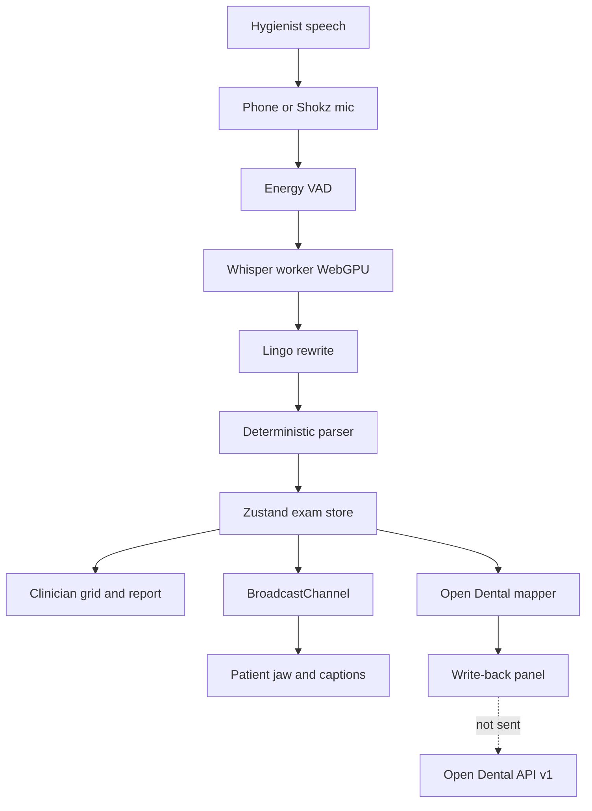
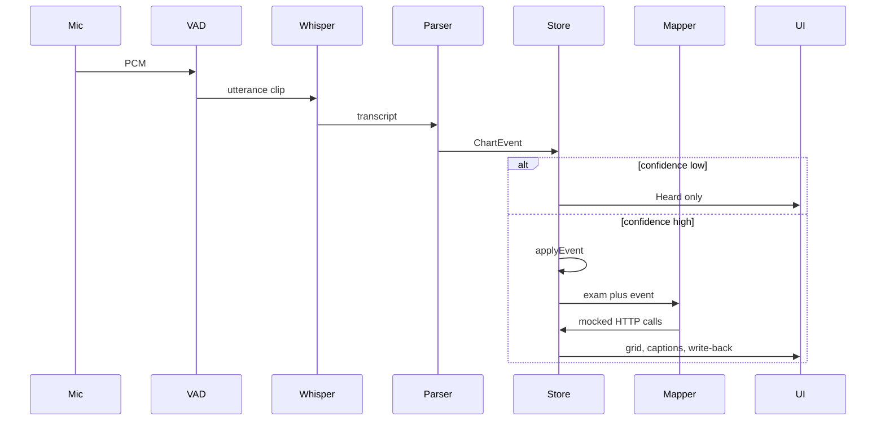

# Architecture: MolarMind

## Decision summary

MolarMind is a single-origin browser application. Capture, parse, chart, translate, and practice-management preview all run in the clinician tab. A second same-origin tab is the patient surface. They share events through BroadcastChannel, not a server.

Speech never leaves the operatory on the critical path. Whisper runs in a Web Worker via Transformers.js. Charting is a deterministic parser. Low-confidence transcripts appear in Heard and do not write the exam or the Open Dental mapper.

Practice-management integration is contracted against the public Open Dental REST API. Today those calls are built and displayed, not sent. The driving principle is stage safety and reversibility: boring local tech, a scripted rehearsal path, and a PMS adapter that can later point at a clinic without rewriting the charting core.

## Context

A hands-free chairside agent. One voice stream serves two people: the hygienist gets a live perio grid and detailed report; the patient gets plain-language captions, a jaw map, and a March-to-today comparison. The seeded patient is Andrew (last visit 12 March 2026).

Constraints: demo-grade, must work offline after Whisper is cached, no LLM on the charting path, no live PMS writes, no hardcoded loopback URLs. The original BUILD note assumed FastAPI, faster-whisper, and a mock HTTP server. The shipped system dropped that process boundary. HIPAA, SSO, and multi-chair hosting are out of scope.

This is a first-run architecture pack. There were no ancestor CEO or Product PM artifacts and no prior `artifacts/04-architecture.md` in this repository. The human asked for a dedicated `architecture/` folder and a detailed PDF; those files are the deliverable.

## Topology

Two peer windows, one Vite process, no application server, no database process.

## Component decisions

### Application runtime
- **Choice:** Vite + React + TypeScript + React Router.
- **Alternatives considered:** Next.js (unwanted server), Electron (packaging cost), Python UI (patient visuals are web-native).
- **Tradeoffs accepted:** COOP/COEP headers required for the worker and WebGPU.
- **Open risks:** Transformers.js first-load can hit a CDN if the model is not cached.

### Capture and STT
- **Choice:** getUserMedia, energy VAD (RMS 0.012, 550 ms silence, 700 ms minimum), Transformers.js `onnx-community/whisper-base.en` q8 on WebGPU, 20 s transcribe timeout, resample to 16 kHz. Mic preference: iPhone Continuity, then Shokz, then headset.
- **Alternatives considered:** Python faster-whisper (original spec), cloud STT (wifi and PHI).
- **Tradeoffs accepted:** model download and WebGPU quality sit in the browser.
- **Open risks:** Continuity mics mute when the phone locks; only one tab may Listen.

### Lingo and parser
- **Choice:** two-pass deterministic pipeline. No regex-led extraction. Table-driven tests are part of the contract.
- **Alternatives considered:** LLM slot filling (stage risk), a single regex grammar (fragile).
- **Tradeoffs accepted:** new slang needs a lexicon entry.
- **Open risks:** Whisper substitutions ("to" / "two") still need coverage.

### Exam store
- **Choice:** Zustand in memory as system of record for the visit.
- **Alternatives considered:** disk DB, remote session, localStorage as source of truth.
- **Tradeoffs accepted:** refresh loses today. Avoid leftover PHI on a shared laptop.
- **Open risks:** no durable visit identity yet.

### Surfaces
- **Choice:** clinician grid plus patient photographed arches and meaning copy. Two physical displays.
- **Alternatives considered:** split pane, native iPad, 3D hero tooth as the only patient story.
- **Tradeoffs accepted:** 3D hero is optional later.
- **Open risks:** photo hotspots must stay aligned if the crop changes.

### Practice management adapter
- **Choice:** Open Dental public REST. In-browser mapper. Env for base URL and demo keys.
- **Alternatives considered:** Dentrix/Eaglesoft (partner-gated), fictional `/mock/opendental/perio` blob, live HTTPS from the SPA.
- **Tradeoffs accepted:** Open Dental is not the majority US PMS. The mapper is isolated so another adapter can sit beside it.
- **Open risks:** clinic keys must never enter a Vite bundle.

### Rehearsal
- **Choice:** hygienist script plus `?script=demo1` spacebar path. Same parser and mapper.
- **Alternatives considered:** recorded audio as the only fallback.
- **Tradeoffs accepted:** presenter must still narrate for the room.
- **Open risks:** script drift versus parser cases.

## Data architecture
- **Stores:** `andrew.json` (seed), Zustand (today), Open Dental session module (exam and measure ids), origin cache (Whisper weights), BroadcastChannel (in flight).
- **Consistency model:** single writer in the clinician tab. Strong in-tab. PMS session is "one PerioExam per visit, one measure per tooth and SequenceType."
- **Retention:** until Reset or reload. Production inverts this.
- **Regional strategy:** none. Production follows the PMS and clinic residency.

## Integration patterns

Internal: in-process calls plus `chairside-events`. External: typed HTTPS-shaped objects, not transmitted.

Future live writes: create exam once, POST then PUT measures, retry without a second exam. Chart stays source of truth if PMS is down.

## Identity, auth, secrets
- **AuthN:** none today.
- **AuthZ:** none today. Reset all uses a confirm dialog only.
- **Secrets:** obvious demo ODFHIR keys in `.env.example`. Never commit a clinic pair. Target is a clinic-owned BFF plus secrets manager.

## Observability
- **Logs:** prefixed console plus Heard plus the write-back panel.
- **Metrics (later):** utterance-to-chart latency (under 1.5 s), Whisper errors, unusable versus written share, OD 4xx/5xx.
- **Traces:** none. Carry a visit id when a BFF exists.
- **Alerts:** none. Page later on PMS write failure after the visit, not on one low-confidence line.

## Cost shape
- **Order of magnitude:** $0 / month incremental for the demo. Clinic pilot is workstation and IT, not cloud inference. A hosted BFF at one to three chairs is low hundreds USD / month.
- **Top 3 cost drivers:** Open Dental program and clinic IT; optional server STT; optional hosted copy model (keep off the chart path).
- **Scaling cliffs:** BroadcastChannel and in-tab Zustand will not survive ten chairs. Do not write PHI into the SPA as a shortcut.

## Failure modes and resilience

Whisper cold start, WebGPU miss, locked Continuity mic, junk transcript, low-confidence parse, 20 s timeout, tab refresh, two-tab Listen, and future OD 4xx are enumerated in the PDF. Demo RTO is "Reset and play the script." Demo RPO is zero durable today-exam. The rehearsal script is the primary resilience control.

## Migration / rollout

Phase 0 current mock. Phase 1 lock fixtures. Phase 2 clinic-owned BFF holds keys. Phase 3 sandbox PatNum with a human Send. Phase 4 SSO, durable store, audit, BAA, then maybe auto-send. Do not point the current SPA at `api.opendental.com`.

## What FSDT will need to know

- No LLM from transcript to tooth cell.
- Low confidence does not write chart or PMS.
- Env for host, routes, model, OD base. No hardcoded loopback.
- Parser stays function-based.
- Canonical OD field names and SequenceTypes. Bleed flags are sums. Crowns D2740 EC, fillings D2391 EC.
- Reset tooth is SkipTooth. COOP/COEP stay. Channel name `chairside-events` stays. Do not seed today’s pockets from March.

## Open questions / decisions deferred

BFF and PHI at rest. Cloud versus on-prem Open Dental API. Commlog versus periomeasures only for mobility. Recall write at wrap-up. 3D hero versus photographed jaw. base.en versus small.en after a latency test. Dentrix as a later adapter versus a different product.

See `MolarMind-Architecture.pdf` in this folder for the full narrative, tables, and figures.
